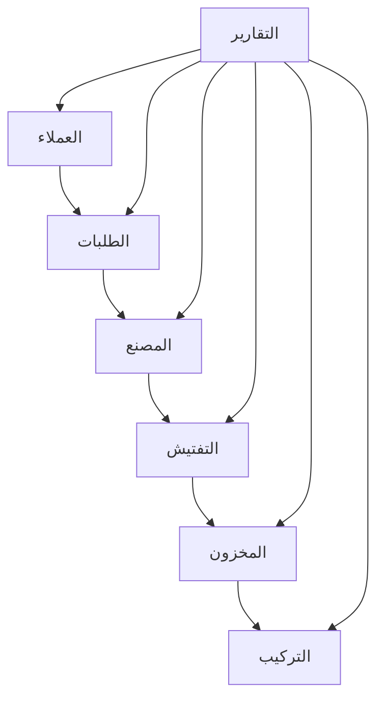

# توثيق نظام إدارة العملاء (CRM)

## نظرة عامة على النظام

### الغرض من النظام
نظام متكامل لإدارة علاقات العملاء يهدف إلى تنظيم وتحسين العمليات التجارية والإنتاجية في المؤسسة.

### المستخدمون المستهدفون
- مديرو النظام
- موظفو خدمة العملاء
- موظفو المبيعات
- موظفو المصنع
- مفتشو الجودة
- فريق التركيب
- مديرو المخزون
- محللو التقارير

### الميزات الرئيسية
- إدارة حسابات المستخدمين والصلاحيات
- إدارة العملاء وعلاقاتهم
- إدارة المصنع وخطوط الإنتاج
- نظام التفتيش والجودة
- إدارة التركيبات والتنفيذ
- إدارة المخزون والمنتجات
- نظام الطلبات والمبيعات
- نظام التقارير والتحليلات

## الهيكل التقني

### لغات البرمجة
- **Backend**: Python 3 (Django Framework)
- **Frontend**: 
  - HTML5
  - CSS3
  - JavaScript
  - jQuery

### الأطر والمكتبات
#### Backend
- Django 3.2.25
- Django REST Framework
- Celery
- django-cors-headers
- django-import-export
- django-environ
- gunicorn

#### Frontend
- Bootstrap 5.3.2 RTL
- Font Awesome 6.5.1
- jQuery 3.7.1

### قاعدة البيانات
- النظام الحالي: SQLite3
- قابل للترقية إلى: PostgreSQL

## الهوية البصرية التفصيلية

### نظام السمات (Themes)
النظام يدعم 11 سمة مختلفة، كل منها بمجموعة ألوان متناسقة:

#### 1. السمة الافتراضية (البني)
```css
--primary: #8B735A
--secondary: #A67B5B
--accent: #5F4B32
--neutral: #B7A99A
--light-bg: #E8DCCA
--dark-text: #3D3427
--alert: #C17817
--light-accent: #D2B48C
```

#### 2. السماوي الفاتح
```css
--primary: #7FB3D5
--secondary: #85C1E9
--accent: #3498DB
--neutral: #BDC3C7
--light-bg: #EBF5FB
--dark-text: #2C3E50
--alert: #E74C3C
--light-accent: #AED6F1
```

#### 3. الوردي الناعم
```css
--primary: #F1948A
--secondary: #F5B7B1
--accent: #E74C3C
--neutral: #FADBD8
--light-bg: #FDEDEC
--dark-text: #943126
--alert: #C0392B
--light-accent: #F2D7D5
```

### الخطوط المستخدمة
- الخط الرئيسي: Cairo
- الخطوط الاحتياطية:
  - Segoe UI
  - Tahoma
  - Geneva
  - Verdana
  - sans-serif

### عناصر الواجهة
1. **الشعار**
   - حجم: 30x30 pixels
   - تأثيرات: انتقال سلس للألوان
   
2. **القوائم**
   - شريط تنقل متجاوب
   - قوائم منسدلة
   - أيقونات Font Awesome

3. **البطاقات**
   - زوايا دائرية: 10px
   - ظل خفيف
   - تأثير حركي عند التحويم
   - حدود بلون neutral

4. **الأزرار**
   - زوايا دائرية: 5px
   - حشو: 8px 16px
   - تأثيرات انتقالية سلسة

### التأثيرات والانتقالات
```css
transition: all 0.3s ease-in-out
```
- انتقالات سلسة للألوان
- تأثيرات حركية للبطاقات
- تحولات متناغمة للأزرار
- انتقالات سلسة لتغيير السمات

### التصميم المتجاوب
- تعديلات خاصة للشاشات الصغيرة (> 768px)
- تعديلات حجم الخط والعناصر
- تكيف القوائم والأزرار
- نظام شبكة Bootstrap المتجاوب

## هيكل النظام المُنظم

### المكونات الرئيسية
```
CRMsystem/
├── accounts/          # نظام الحسابات
├── customers/         # إدارة العملاء
│   └── templates/
│       └── customers/
│           ├── category_list.html      # قائمة التصنيفات
│           ├── customer_confirm_delete.html  # تأكيد حذف العميل
│           ├── customer_detail.html    # تفاصيل العميل
│           ├── customer_form.html      # نموذج إضافة/تعديل العميل
│           └── customer_list.html      # قائمة العملاء
├── factory/          # إدارة المصنع
│   └── templates/
│       └── factory/
│           ├── dashboard.html          # لوحة التحكم
│           ├── factory_list.html       # قائمة المصانع
│           ├── production_line_*.html  # قوالب خط الإنتاج
│           ├── production_order_*.html # قوالب أوامر الإنتاج
│           └── quality_check_*.html    # قوالب فحص الجودة
├── inspections/      # نظام التفتيش
│   └── templates/
│       └── inspections/
│           ├── dashboard.html          # لوحة التحكم
│           ├── inspection_*.html       # قوالب التفتيش
│           ├── evaluation_form.html    # نموذج التقييم
│           └── report_*.html          # قوالب التقارير
├── installations/    # إدارة التركيبات
│   └── templates/
│       └── installations/
│           ├── dashboard.html          # لوحة التحكم
│           ├── installation_*.html     # قوالب التركيب
│           └── transport_*.html       # قوالب النقل
├── inventory/        # إدارة المخزون
│   ├── templates/
│   │   └── inventory/
│   │       ├── dashboard.html
│   │       ├── inventory_list.html
│   │       ├── product_confirm_delete.html
│   │       ├── product_detail.html
│   │       ├── product_form.html
│   │       ├── product_list.html
│   │       └── transaction_form.html
│   ├── templatetags/
│   │   └── inventory_math_filters.py
│   └── static/
│       └── inventory/
├── orders/          # نظام الطلبات
│   └── templates/
│       └── orders/
│           ├── order_*.html           # قوالب الطلبات
│           ├── payment_*.html         # قوالب المدفوعات
│           └── accessory_*.html       # قوالب الملحقات
├── reports/         # نظام التقارير
│   └── templates/
│       └── reports/
│           ├── report_*.html          # قوالب التقارير
│           └── includes/              # قوالب فرعية للتقارير
├── static/          # الملفات الثابتة
└── templates/       # القوالب العامة للنظام
    ├── base.html    # القالب الأساسي
    ├── home.html    # الصفحة الرئيسية
    ├── about.html   # صفحة حول النظام
    └── contact.html # صفحة الاتصال
```

### العلاقات بين المكونات
1. **نظام الحسابات**
   - يتحكم في الوصول لجميع المكونات
   - يدير الصلاحيات والأدوار
   - يوفر نظام الإشعارات

2. **إدارة العملاء**
   - يرتبط بنظام الطلبات
   - يتكامل مع التركيبات
   - يوفر بيانات للتقارير

3. **المصنع**
   - يرتبط بالمخزون
   - يتكامل مع التفتيش
   - يؤثر على الطلبات

### تدفق البيانات


## وصف تفصيلي للوحدات

### 1. الحسابات (accounts)
- نظام تسجيل الدخول
- إدارة المستخدمين
- الصلاحيات والأدوار
- نظام الإشعارات
- معالجة سياق النظام

### 2. العملاء (customers)
- معلومات العملاء
- سجل التعاملات
- تتبع الطلبات
- إدارة العلاقات

### 3. المصنع (factory)
- إدارة خطوط الإنتاج
- جدولة الإنتاج
- متابعة العمليات
- مراقبة الجودة

### 4. التفتيش (inspections)
- معايير الجودة
- نماذج التفتيش
- تقارير الفحص
- متابعة الإصلاحات

### 5. التركيبات (installations)
- جدولة التركيب
- فرق العمل
- متابعة التنفيذ
- تقارير الإنجاز

### 6. المخزون (inventory)
- إدارة المنتجات
- تتبع المخزون
- حركة البضائع
- جرد المخزون

قوالب المخزون المنظمة:
- dashboard.html: لوحة التحكم الرئيسية
- inventory_list.html: قائمة المخزون
- product_detail.html: تفاصيل المنتج
- product_form.html: نموذج إضافة/تعديل المنتج
- product_confirm_delete.html: تأكيد حذف المنتج
- product_list.html: قائمة المنتجات
- transaction_form.html: نموذج المعاملات

### 7. الطلبات (orders)
- إدارة المبيعات
- متابعة الطلبات
- مندوبي المبيعات
- تقارير المبيعات

### 8. التقارير (reports)
- تقارير إحصائية
- تحليلات البيانات
- مؤشرات الأداء
- التقارير المخصصة

## الواجهة الأمامية

### هيكل القوالب
```
templates/
├── base.html              # القالب الأساسي
├── home.html             # الصفحة الرئيسية
├── about.html            # صفحة حول النظام
└── contact.html          # صفحة الاتصال
```

### المكونات المشتركة
1. **شريط التنقل**
   - قائمة رئيسية
   - نظام إشعارات
   - قائمة مستخدم
   - محدد السمات

2. **التذييل**
   - معلومات الشركة
   - روابط سريعة
   - معلومات الاتصال

3. **عناصر التفاعل**
   - أزرار
   - نماذج
   - جداول
   - تنبيهات

## الواجهة الخلفية

### API Endpoints
1. **المستخدمين والمصادقة**
   - تسجيل الدخول/الخروج
   - إدارة الملف الشخصي
   - إدارة الصلاحيات

2. **العمليات التجارية**
   - إدارة العملاء
   - الطلبات والمبيعات
   - المخزون والمنتجات

3. **عمليات المصنع**
   - خطوط الإنتاج
   - التفتيش والجودة
   - التركيبات

### المعالجات
- Django Views
- REST API Views
- Form Handlers
- Task Processors

### الخدمات
- Celery Tasks
- Background Jobs
- Scheduled Tasks
- Integration Services

## الأمان والصلاحيات

### نظام المصادقة
- تسجيل الدخول الآمن
- إدارة الجلسات
- تجديد كلمات المرور
- مصادقة JWT للـ API

### إدارة الصلاحيات
- أدوار المستخدمين
- صلاحيات خاصة
- صلاحيات المجموعات
- تقييد الوصول

### حماية البيانات
- CSRF Protection
- XSS Prevention
- SQL Injection Protection
- SSL/TLS Support

## متطلبات التطوير المستقبلي

### النقاط المقترحة للتحسين
1. **الواجهة الأمامية**
   - تحديث إلى React/Vue.js
   - تحسين UX/UI
   - دعم PWA
   - تحسين الأداء

2. **الواجهة الخلفية**
   - ترقية Django
   - تحسين الـ API
   - أتمتة المهام
   - تحسين الأداء

3. **قاعدة البيانات**
   - الترقية إلى PostgreSQL
   - تحسين الاستعلامات
   - تحسين الأداء
   - النسخ الاحتياطي التلقائي

### الميزات المستقبلية
1. **تكامل الأنظمة**
   - ربط مع المحاسبة
   - ربط مع الموارد البشرية
   - ربط مع نظام الشحن
   - ربط مع أنظمة الدفع

2. **تحليلات متقدمة**
   - تحليلات تنبؤية
   - لوحات تحكم تفاعلية
   - تقارير ذكية
   - مؤشرات أداء متقدمة

3. **تحسينات تقنية**
   - تحسين SEO
   - تحسين الأداء
   - تحسين الأمان
   - دعم متعدد اللغات
